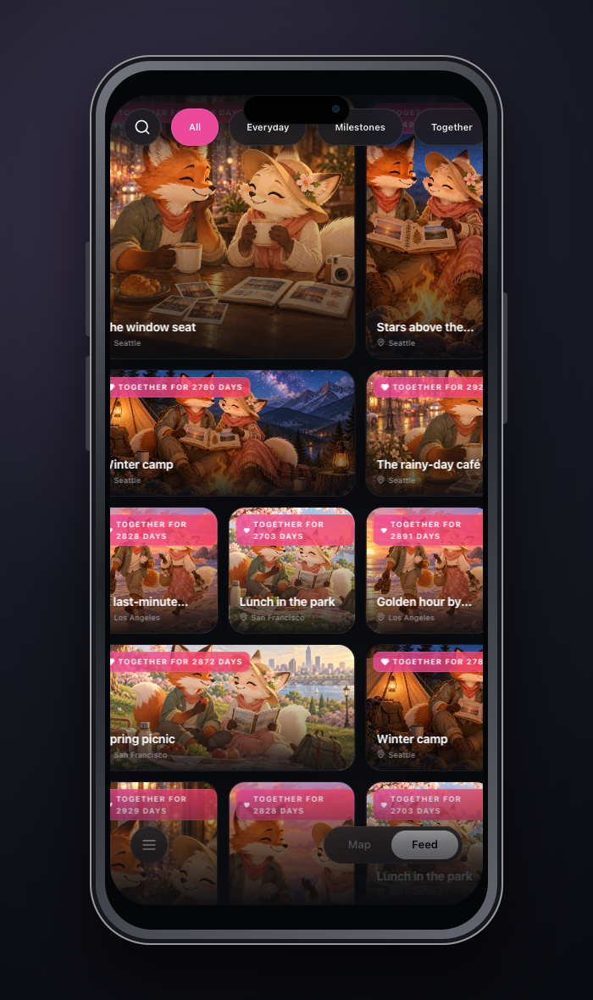
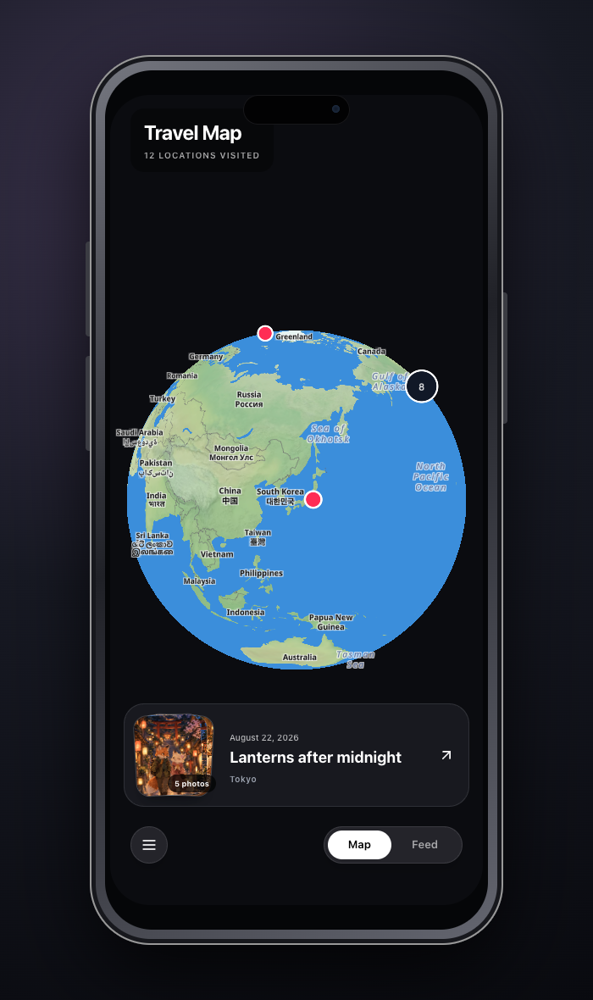
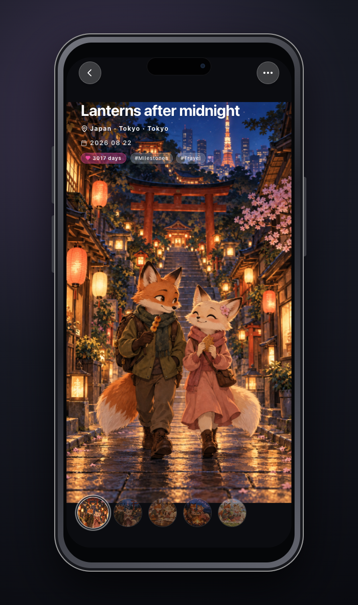
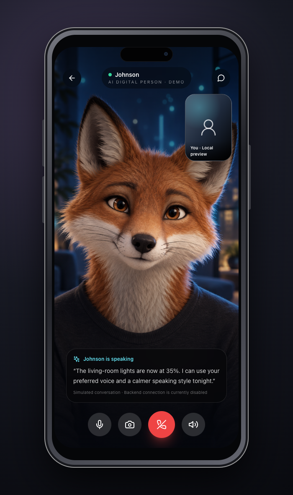
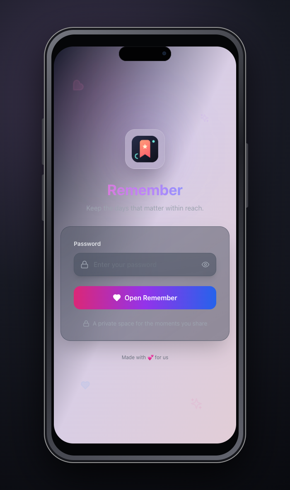

<div align="center">
  
  <h1>Remember</h1>
  <p><strong>A quiet, self-hosted home for photos, places, and the stories between them.</strong></p>
  <p>Visual memory journal · Interactive map · Johnson digital person · Private by default</p>
</div>

Remember turns a camera roll into a browsable story. Add a date, place, note, and tags to each memory; then rediscover it through a visual feed, geographic map, or related moments. It is designed for personal hosting, with data and uploads staying on infrastructure you control.


## See it in action

| Visual feed | Interactive memory map |
| --- | --- |
|  |  |

| Featured multi-photo memory | Johnson video-call demo |
| --- | --- |
|  |  |

| Private sign-in | Map memory card |
| --- | --- |
|  |  |

## What it does

Remember gives photos the context they usually lose. A memory can hold several images, a place, personal notes, tags, and details from the trip—such as a hotel stay or a room-card photo. Everything comes together in a visual timeline, while the globe offers another way to revisit the same stories by country, city, or exact location.

The included demo follows two fox characters through twelve fictional memories, from a spring picnic in New York to a lantern-lit night in Tokyo. The Tokyo story is the most complete example: it opens with a full-screen portrait cover and continues as a four-photo gallery.

Johnson is the companion inside Remember. You can talk to him through a familiar video-call interface, ask about anything saved in Remember, or use everyday language to control connected lights, climate, and scenes at home. His personality and way of speaking can be changed, and—with permission—his voice can be based on a chosen reference.

Remember is private by default and can be installed as a PWA. Password access, local photo storage, thumbnails, and authenticated sessions are all included in the repository.

## Run locally

Requirements: Node.js 18+, npm, and SQLite.

```bash
git clone https://github.com/amamam156/Remember.git
cd Remember

cd backend
cp .env.example .env
npm install
npm run db:generate
npm run db:push
npm run db:seed
npm run db:init:users
npm run dev
```

In a second terminal:

```bash
cd frontend
npm install
npm run dev
```

Open `http://localhost:5173`. Set `REMEMBER_INITIAL_PASSWORD` in `backend/.env`; the sign-in screen only asks for that password.

### Load the fictional showcase data

```bash
cd backend
npm run db:seed:demo
```

The default demo password is `remember-demo`. Override it with `REMEMBER_DEMO_PASSWORD` before seeding. The script only replaces memories owned by the `demo` account.

## Docker

```bash
docker compose up --build -d
```

Set `JWT_SECRET`, `REMEMBER_INITIAL_PASSWORD`, and `CORS_ORIGIN`. Place persistent storage anywhere with `REMEMBER_DATA_PATH` and `REMEMBER_UPLOADS_PATH`; otherwise local `./data` and `./uploads` directories are used.

## Stack

- React 18, TypeScript, Vite, Tailwind CSS
- Express, Prisma, SQLite
- MapLibre GL, Sharp, JWT authentication
- Docker Compose and Nginx

## Project status

Remember is a working personal project and product showcase. The journal, uploads, maps, hotels, tags, private access, and Johnson experience form its current product surface.

## License

No license has been added yet. All rights are reserved by the repository owner.
